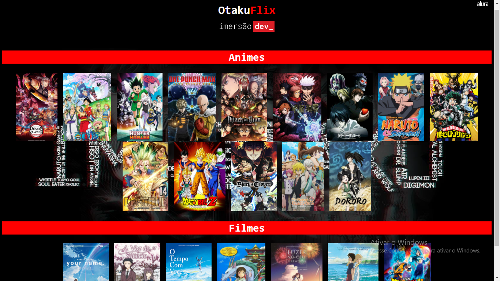

<b>> Resultado da OtakuFlix quase finalizado.</b>
Desenvolvido atraves da Imersão Dev da Alura. Ainda falta criar o botão para adicionar mais animes e filmes.

O projeto foi criado em:

- [x] Criação do HTML
- [x] Criação do CSS
- [x] Criação do JavaScript

Resultado: https://gleysiferreira.github.io/OtakuFlix/

## 🤝 Colaboradores

Pessoa que contribuiu para este projeto:

<table>
  <tr>
    <td align="center">
         
        
          <b>Gleysi Ferreira</b>
        
      </a>
    </td>
   </tr>
</table>
